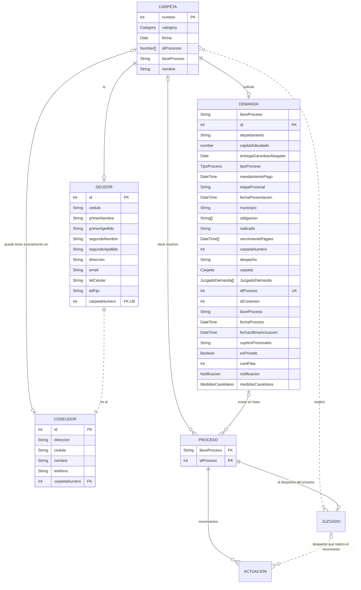

# Mermaid

```mermaid
erDiagram

CARPETA ||--o| DEUDOR  : is
CARPETA |o--o|CODEUDOR : "puede tener exactamente un"
CARPETA ||--o| DEMANDA  : judicial
CARPETA |o--o{ PROCESO : "tiene muchos"
CARPETA }|..|{ JUZGADO : implicit
DEMANDA |o--o{ PROCESO  : "existe en linea"
PROCESO ||--o| JUZGADO : "el despacho del proceso"
PROCESO ||--o{ ACTUACION : movimientos
JUZGADO |o..o{ ACTUACION : "despacho que realizo el movimiento"
DEUDOR ||..||CODEUDOR : "es el"

DEMANDA{
  String llaveProceso
  Int   id  PK
  String departamento
  number     capitalAdeudado
  Date   entregaGarantiasAbogado
  TipoProceso        tipoProceso
  DateTime          mandamientoPago
  String etapaProcesal
  DateTime          fechaPresentacion
  String municipio
  String[] obligacion
  String radicado
  DateTime[]         vencimientoPagare
  Int                carpetaNumero
  String despacho
  Carpeta            carpeta
  JuzgadoDemanda[] JuzgadoDemanda
  Int                idProceso     UK
  Int idConexion
  String llaveProceso
  DateTime          fechaProceso
  DateTime          fechaUltimaActuacion
  String sujetosProcesales
  Boolean esPrivado
  Int cantFilas
  Notificacion notificacion
  MedidasCautelares medidasCautelares
}

PROCESO{
    String llaveProceso FK
    Int idProceso PK
}

CARPETA {
    Int numero PK
    Category category
    Date fecha
    Number[] idProcesos
    String llaveProceso
    String nombre

}

CODEUDOR{
  Int   id  PK
  String direccion
  String cedula
  String nombre
  String telefono
  Int   carpetaNumero FK
}
DEUDOR{
Int  id   PK
String cedula
String primerNombre
String primerApellido
String segundoNombre
String segundoApellido
String direccion
String email
String telCelular
String telFijo
Int   carpetaNumero    FK, UK
}
```
