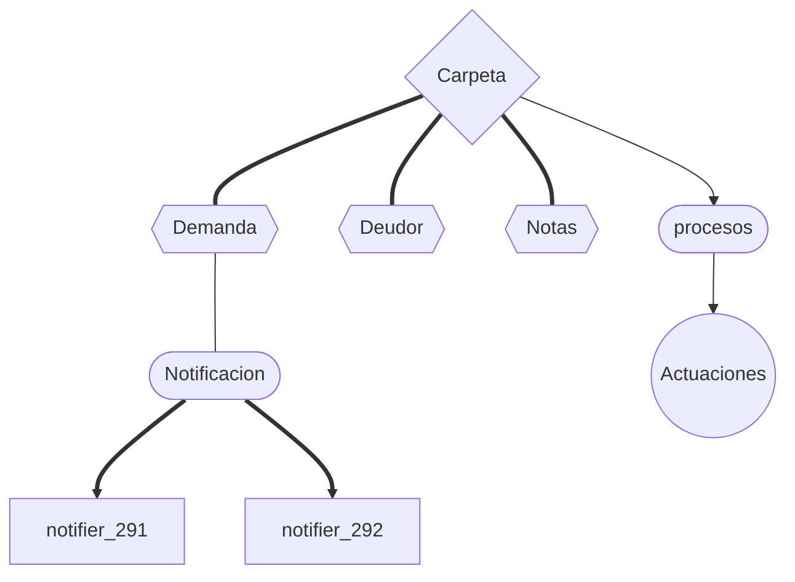
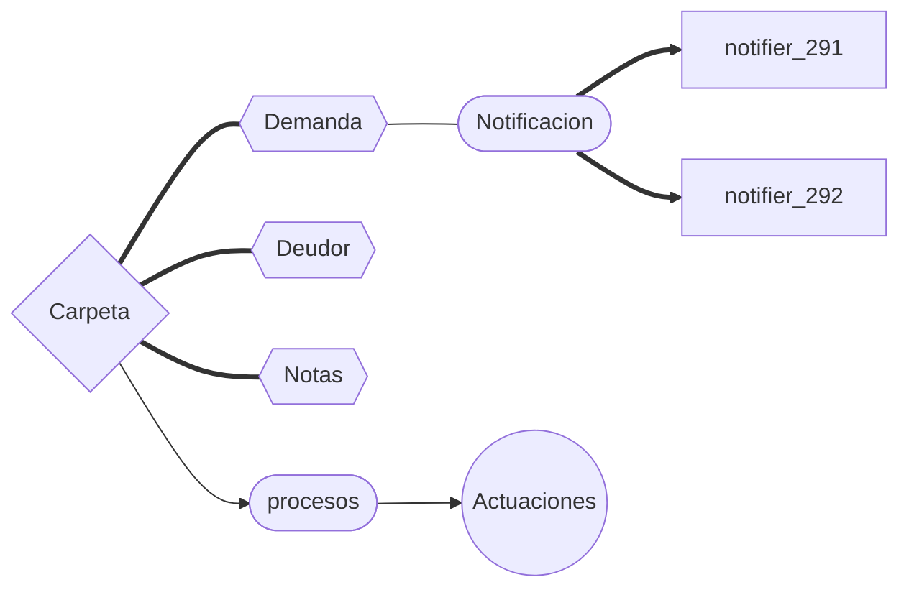
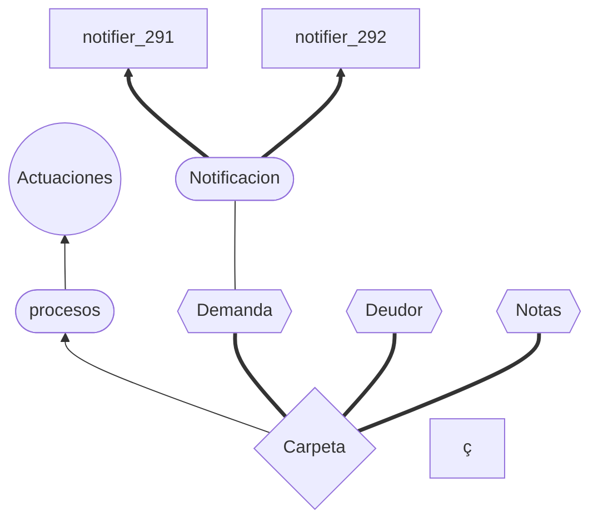

# mermaid pruebas

```mermaid
flowchart TB
 A{Carpeta} === B{{Demanda}}
 A === I{{Deudor}}
    B --- J([Notificacion])
    J ==> K[notifier_291]
    J ==> L[notifier_292]
    A === C{{Notas}}
    A --> M([procesos])
    M --> N((Actuaciones))
```

```mermaid
flowchart LR
 A{Carpeta} === B{{Demanda}}
 A === I{{Deudor}}
    B --- J([Notificacion])
    J ==> K[notifier_291]
    J ==> L[notifier_292]
    A === C{{Notas}}
    A --> M([procesos])
    M --> N((Actuaciones))
```

```mermaid
flowchart BT
    A --> M([procesos])
    ç
    M --> N((Actuaciones))
 A{Carpeta} === B{{Demanda}}
 A === I{{Deudor}}
    B --- J([Notificacion])
    J ==> K[notifier_291]
    J ==> L[notifier_292]
    A === C{{Notas}}
```
